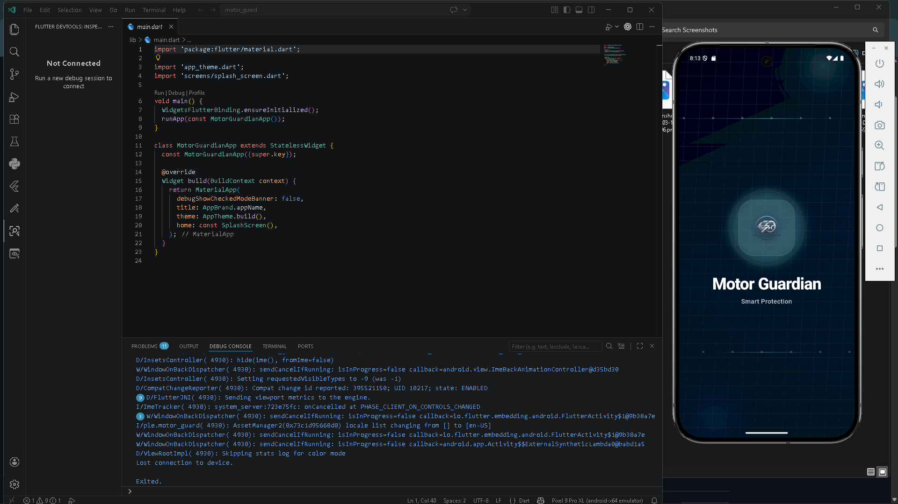
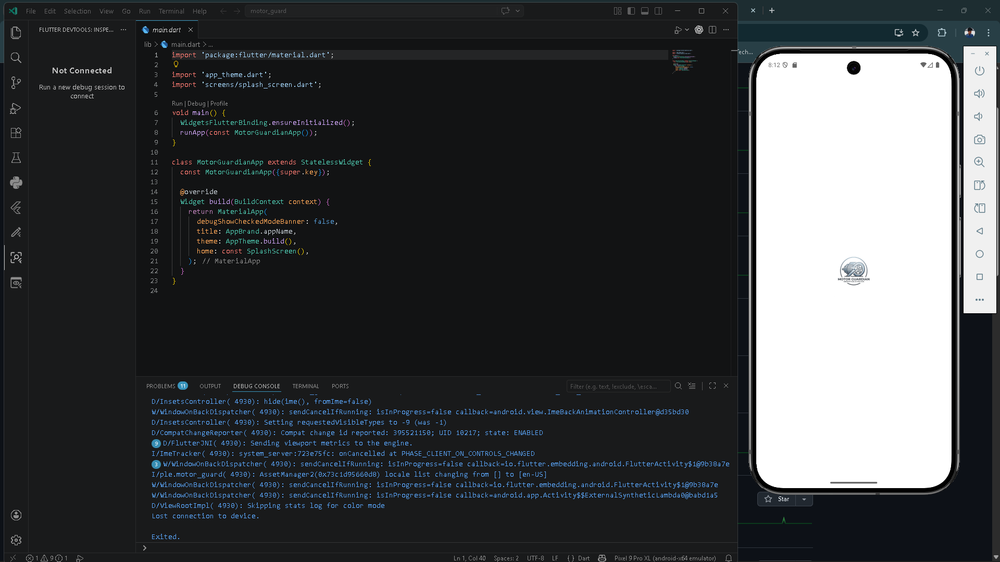
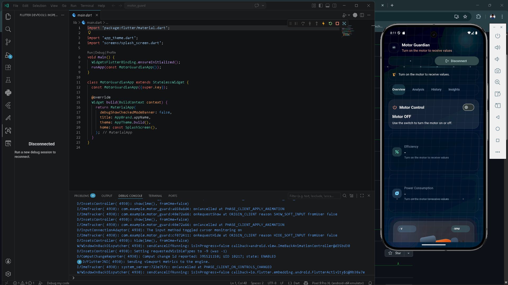
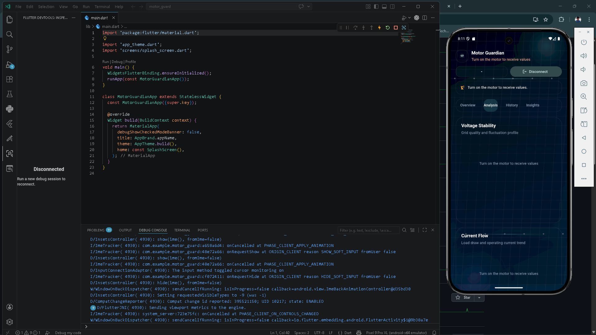
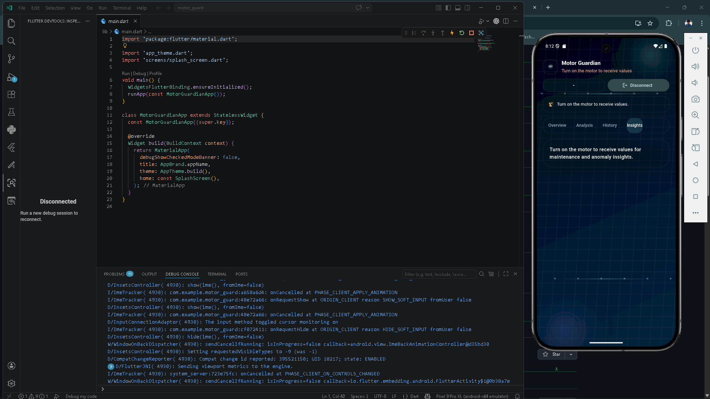
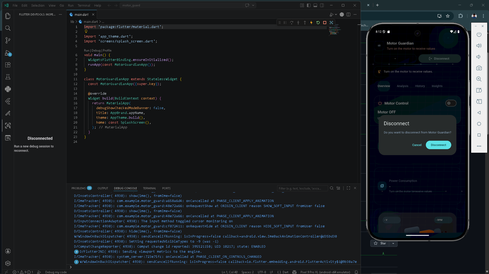

# Motor Guardian

A comprehensive real-time motor health monitoring and anomaly detection application built with Flutter and MQTT for IoT communication. Motor Guard provides intelligent predictive maintenance insights to prevent motor failures and optimize industrial operations.

##  Table of Contents

- [Overview](#overview)
- [Screenshots](#screenshots)
- [Features](#features)
- [Architecture](#architecture)
- [Technology Stack](#technology-stack)
- [Project Structure](#project-structure)
- [Installation](#installation)
- [Configuration](#configuration)
- [Usage](#usage)
- [Screenshots](#screenshots)
- [Supported Platforms](#supported-platforms)
- [API Reference](#api-reference)
- [Contributing](#contributing)
- [License](#license)

## Overview

Motor Guard is a production-ready monitoring solution designed for industrial IoT environments. It connects to motor sensors via MQTT protocol, processes real-time telemetry data, and applies intelligent anomaly detection algorithms to identify potential issues before they become critical failures.

### Key Capabilities

- **Real-Time Monitoring**: Live streaming of motor telemetry data at continuous intervals
- **Intelligent Anomaly Detection**: Deep analysis of voltage, temperature, vibration, and current patterns
- **Predictive Alerts**: Early warning system with configurable thresholds
- **Cross-Platform Support**: Works seamlessly across iOS, Android, Windows, macOS, Linux, and Web
- **Secure MQTT Connection**: TLS/SSL encrypted communication with HiveMQ Cloud broker
- **Responsive UI**: Adaptive Material Design interface with real-time charts and visualizations


## Screenshots

### Application Interface

The following screenshots showcase Motor Guard's user interface and functionality:

#### Screen 1: Welcome/Splash

Initial app launch screen with branding and loading animation.

#### Screen 2: Connection Setup

MQTT broker authentication interface with username/password fields.

#### Screen 3: Dashboard Overview

Real-time monitoring dashboard with motor status and key metrics.

#### Screen 4: Motor Details

Detailed motor information with individual parameter display.

#### Screen 5: Telemetry Charts

Time-series visualization of voltage, current, temperature, and vibration data.

#### Screen 6: Anomaly Alerts

Real-time anomaly notifications with alert status and recommendations.

#### Screen 7: Settings & Configuration

Configuration panel for adjusting thresholds and MQTT parameters.


## Features

### Core Functionality

✅ **MQTT Connectivity**
- Secure TLS/SSL connection to HiveMQ Cloud broker
- Automatic subscription to telemetry topics
- Real-time data streaming and event handling
- Relay control via MQTT publish

✅ **Anomaly Detection Engine**
- Temperature monitoring with dual thresholds
  - Warning threshold: 40°C
  - Critical cutoff: 50°C
- Vibration anomaly detection (≥1.0 threshold)
- Voltage fluctuation analysis (8V deviation)
- Compound status determination combining all sensors

✅ **Motor Data Telemetry**
- Real-time voltage tracking (automatic 230V ↔ 110V normalization)
- Current consumption monitoring
- RPM (Rotational Speed) measurement
- Temperature sensing
- Vibration analysis

✅ **User Interface**
- Splash screen with branding
- Connection setup screen with authentication
- Comprehensive dashboard with real-time charts
- Motor avatars with status indicators
- Sensor cards for individual parameter display
- Telemetry visualization with line charts
- Anomaly banner for alert display

## Architecture

```
├── Core Services
│   ├── MQTTService       → IoT broker connectivity and messaging
│   └── AnomalyEngine     → Real-time anomaly detection logic
├── Models
│   └── MotorData         → Telemetry data structure and parsing
├── Screens
│   ├── SplashScreen      → App initialization and branding
│   ├── ConnectScreen     → MQTT broker authentication
│   └── DashboardScreen   → Real-time monitoring interface
├── Widgets
│   ├── MotorAvatar       → Motor status visualization
│   ├── SensorCard        → Individual sensor display
│   ├── TelemetryChart    → Time-series data visualization
│   ├── AnomalyBanner     → Alert notifications
│   └── MotorVisualization → 3D motor representation
└── UI/Theme
    ├── AppTheme          → Centralized styling system
    └── AppMotionBackground → Animated background effects
```

## Technology Stack

### Framework & Language
- **Flutter**: 3.11.1+ (latest stable)
- **Dart**: 3.11.1+ with null safety
- **Material Design 3**: Modern UI components and patterns

### Dependencies
```
mqtt_client: ^10.11.9       # MQTT protocol implementation
cupertino_icons: ^1.0.8     # iOS-style icon library
```

### Development Tools
```
flutter_test              # Testing framework
flutter_lints: ^6.0.0     # Code quality analysis
flutter_launcher_icons: ^0.14.4  # App icon generation
```

### Cloud Services
- **HiveMQ Cloud**: Enterprise MQTT broker
  - Broker: `b430c21bbccd4810b64214467105b56e.s1.eu.hivemq.cloud`
  - Port: 8883 (TLS/SSL)
  - Authentication: Username/Password

## Project Structure

```
motor_guard/
├── lib/
│   ├── main.dart                      # Application entry point
│   ├── app_theme.dart                 # Theming system (colors, typography, shapes)
│   ├── app_motion_background.dart     # Animated background widget
│   ├── core/
│   │   ├── mqtt_service.dart          # IoT connectivity layer
│   │   └── anomaly_engine.dart        # Detection algorithms
│   ├── models/
│   │   └── motor_data.dart            # Data structures and serialization
│   ├── screens/
│   │   ├── splash_screen.dart         # Launch/initialization screen
│   │   ├── connect_screen.dart        # Broker authentication interface
│   │   └── dashboard_screen.dart      # Main monitoring dashboard
│   └── widgets/
│       ├── motor_avatar.dart          # Motor status indicator
│       ├── sensor_card.dart           # Parameter display card
│       ├── telemetry_chart.dart       # Real-time chart visualization
│       ├── anomaly_banner.dart        # Alert notification widget
│       └── motor_visualization.dart   # 3D motor graphic
├── assets/
│   └── images/                        # Static image resources
├── android/                           # Android native code (Gradle)
├── ios/                               # iOS native code (Swift/Xcode)
├── windows/                           # Windows native code (C++)
├── linux/                             # Linux native code
├── macos/                             # macOS native code
├── web/                               # Web target files
├── test/                              # Unit and widget tests
├── pubspec.yaml                       # Package manifest and dependencies
├── analysis_options.yaml              # Lint rules and code analysis
└── README.md                          # This file
```

## Installation

### Prerequisites
- Flutter SDK 3.11.1 or later
- Dart SDK 3.11.1 or later
- IDE: VS Code, Android Studio, or Xcode
- For mobile: Android SDK API 21+ / iOS 12.0+

### Setup Steps

1. **Clone the repository**
   ```bash
   git clone <repository-url>
   cd motor_guard
   ```

2. **Install dependencies**
   ```bash
   flutter pub get
   ```

3. **Generate code (if needed)**
   ```bash
   flutter pub run build_runner build
   ```

4. **Run on device/emulator**
   ```bash
   # List available devices
   flutter devices
   
   # Run on specific device
   flutter run -d <device-id>
   ```

5. **Build for production**
   ```bash
   # Android APK
   flutter build apk --release
   
   # iOS IPA
   flutter build ios --release
   
   # Web
   flutter build web --release
   ```

## Configuration

### MQTT Broker Settings

Update credentials in `lib/core/mqtt_service.dart`:

```dart
static const String brokerUrl = "b430c21bbccd4810b64214467105b56e.s1.eu.hivemq.cloud";
static const int portNumber = 8883;
static const String _telemetryTopic = "motor_guardian/telemetry";
static const String _relayTopic = "motor_guardian/relay";
```

### Anomaly Detection Thresholds

Configure sensitivities in `lib/core/anomaly_engine.dart`:

```dart
static const double _voltageFluctuationThreshold = 8.0;        // Volts
static const double alertTemperatureThreshold = 40.0;           // Celsius
static const double cutoffTemperatureThreshold = 50.0;          // Celsius
static const double vibrationThreshold = 1.0;                   // m/s²
```

## Usage

### Connecting to MQTT Broker

1. **Launch the App**: SplashScreen initializes the application
2. **Navigate to Connection**: Connect screen appears with input fields
3. **Enter Credentials**: 
   - Username: HiveMQ Cloud username
   - Password: HiveMQ Cloud password
4. **Authenticate**: App establishes TLS connection to broker
5. **Monitor**: Dashboard displays real-time telemetry and anomalies

### Reading Telemetry Data

The app subscribes to `motor_guardian/telemetry` topic expecting JSON:

```json
{
  "voltage": 230,
  "current": 15.5,
  "rpm": 1800,
  "temperature": 45,
  "vibration": 0.8
}
```

### Interpreting Alerts

| Alert Type | Condition | Severity |
|---|---|---|
| Motor Overheating | Temperature ≥ 50°C | 🔴 Critical |
| Temperature Warning | 40°C ≤ Temperature < 50°C | 🟠 Warning |
| Motor Vibration Abnormal | Vibration ≥ 1.0 m/s² | 🟡 Alert |
| Voltage Fluctuating | Voltage change ≥ 8V | 🟡 Alert |

## Supported Platforms

| Platform | Status | Target Version | Notes |
|---|---|---|---|
| 🤖 Android | ✅ Supported | API 21+ | Full functionality |
| 🍎 iOS | ✅ Supported | 12.0+ | Full functionality |
| 💻 Windows | ✅ Supported | 10/11 | Native desktop app |
| 🖥️ macOS | ✅ Supported | 10.14+ | ARM64 compatible |
| 🐧 Linux | ✅ Supported | Ubuntu 18.04+ | GTK3+ required |
| 🌐 Web | ✅ Supported | Modern browsers | Chrome, Firefox, Safari, Edge |

## API Reference

### MQTTService Class

```dart
class MQTTService {
  // Establish connection to MQTT broker
  Future<void> connect(String username, String password)
  
  // Callback for receiving telemetry data
  Function(Map<String,dynamic>)? onData
  
  // Underlying MQTT client
  late MqttServerClient client
}
```

### AnomalyEngine Class

```dart
class AnomalyEngine {
  // Check if temperature in warning range
  static bool isTempWarning(double temperature)
  
  // Check if temperature critical
  static bool isTempHigh(double temperature)
  
  // Check if vibration anomalous
  static bool isVibrationHigh(double vibration)
  
  // Check for voltage fluctuation
  static bool isVoltageFluctuating(List<double> voltageHistory)
  
  // Get combined status string
  static String status({
    required List<double> voltageHistory,
    required double temperature,
    required double vibration
  })
}
```

### MotorData Model

```dart
class MotorData {
  final double voltage;        // Normalized to 110V scale
  final double current;        // Amperes
  final double rpm;           // Rotations per minute
  final double temperature;   // Celsius
  final double vibration;     // m/s²
  
  // Parse JSON from MQTT payload
  factory MotorData.fromJson(Map<String,dynamic> json)
}
```

## Contributing

1. Create a feature branch: `git checkout -b feature/your-feature`
2. Make your changes following Dart style guidelines
3. Run tests: `flutter test`
4. Ensure code quality: `flutter analyze`
5. Format code: `dart format lib/`
6. Commit with clear messages: `git commit -m "Add: description"`
7. Push and create a Pull Request

## License

This project is licensed under the MIT License - see LICENSE file for details.

---

**Built with ❤️ for Industrial IoT Monitoring**
